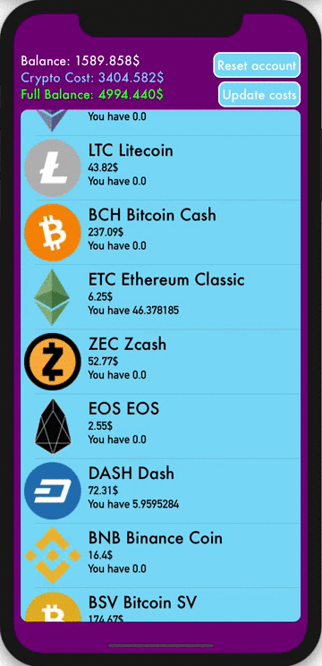

# CryptoSimulator

## Технологии: Реализован паттерн MVVM с помощью RxSwift
## Хранение данных: База данных Realm
## Работа с сетью: Парсинг данных биржи с помощью SwiftSoup
## Описание
Приложение сделано для подготовки пользователя к игре на бирже криптовалют.
На виртуальную валюту пользователь может покупать и продавать криптовалюту,
причем цена криптовалюты обноляется в онлайн режиме и соответсвует реальной цене на данный момент.

